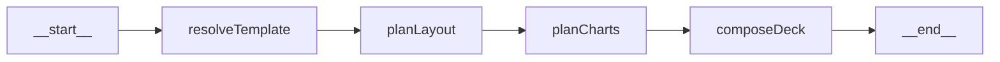

# Slide Renderer Orchestration

Bu doküman, içerik üretiminden sonra çalışan yeni `slide render` hattını açıklar.

## Amaç

- Kullanıcının seçtiği template'e göre slaytları otomatik görselleştirmek
- Her slayt için uygun layout seçmek
- Gerekli durumlarda bullet'lardan veri çıkarıp chart oluşturmak
- Sonucu `.pptx` olarak indirmek

## Girdi/Çıktı

Girdi (`SlideRenderRequest`):
- `slides: SlideOutline[]`
- `config: PresentationConfig`
- `templateId: DeckTemplateId`
- `fileName?: string`

Çıktı (`SlideRenderResult`):
- `fileName`
- `mimeType`
- `base64` (PPTX binary)

Tipler: `src/types/render.ts`

## Template Library

Dosya: `src/slide-renderer/templates.ts`

Template library (currently 9 template):
1. `reveal-black`
2. `reveal-white`
3. `reveal-league`
4. `reveal-sky`
5. `reveal-solarized`
6. `reveal-dracula`
7. `reveal-blood`
8. `reveal-beige`
9. `reveal-moon`

Kaynak/attribution: [template-sources.md](/Users/aydin/Desktop/apps/ppt-generator/docs/template-sources.md)

## LangGraph Akışı

Graph dosyası: `src/slide-renderer/graph.ts`

Node sırası:
1. `resolveTemplate`
2. `planLayout`
3. `planCharts`
4. `composeDeck`

### Node Detayları

1. `resolveTemplate`
- `templateId` ile template metadata/palette çözer.

2. `planLayout`
- Slayt tipine ve bullet yoğunluğuna göre layout seçer.
- Örnek layout'lar: `title-focus`, `content-two-column`, `chart-right`

3. `planCharts`
- Bullet metninden sayısal verileri regex ile çıkarır.
- 2+ veri noktası varsa chart spec üretir.
- Oransal veri için `pie`, diğer durumlarda `bar`.

4. `composeDeck`
- `pptxgenjs` ile final slaytları üretir.
- Slide shell + title + key message + bullets + chart + notes ekler.
- `base64` çıktı döner.

## API Katmanı

1. `GET /api/templates`
- Template listesini döner.

2. `POST /api/render`
- Render pipeline'ı çalıştırır.
- Binary `.pptx` döner (`Content-Disposition: attachment`)

Dosyalar:
- `src/app/api/templates/route.ts`
- `src/app/api/render/route.ts`

## UI Entegrasyonu

Ana sayfa (`src/app/page.tsx`) slides aşamasında:
- Template kart listesi (`TemplatePicker`)
- `Export .pptx` butonu
- Seçilen template ile `/api/render` çağrısı

Template picker:
- `src/components/TemplatePicker.tsx`

## Notlar

- Mevcut içerik üretim graph'ı (document extraction/style/content/outline/write/review) korunmuştur.
- Yeni render orchestration ayrı bir graph olarak eklendi.
