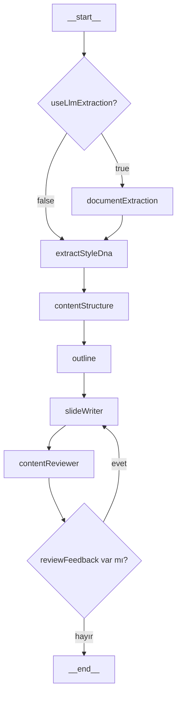

# PPT Generator - Teknik Mimari ve LangGraph Akışı

Bu doküman, uygulamanın üretim pipeline'ını teknik seviyede açıklar:
- Hangi LangGraph agent/node'ları var
- Hangi sırada ve hangi koşullarla çalışıyorlar
- State alanları nasıl taşınıyor
- Hata/geri-besleme (review loop) nasıl yönetiliyor

## 1) Genel Mimari

Uygulama iki ana backend endpoint'i ile çalışır:

1. `POST /api/upload`
- Dosyayı alır, MIME tipini uzantıdan çıkarır.
- Destekli formatlardan metin çıkarır (`pdf/docx/pptx/xlsx/csv/txt`).
- Dönen çıktı: `{ text, charCount }`.

2. `POST /api/generate`
- `documentText + config` alır.
- LangGraph pipeline'ını stream modunda çalıştırır.
- SSE (`text/event-stream`) ile node bazlı event yayınlar:
  - `{ type: "stage", node: "<nodeName>" }`
  - `{ type: "done", slides: [...] }`
  - `{ type: "error", message: "..." }`

İlgili dosyalar:
- `src/app/api/upload/route.ts`
- `src/app/api/generate/route.ts`
- `src/agents/index.ts`

## 2) LangGraph Agent/Node Listesi

Graph tanımı: `src/agents/graph.ts`

Node'lar:
1. `documentExtraction`
- Dosya metnini tam olarak `slideCount` kadar bölüme ayırır.
- Sadece `config.useLlmExtraction = true` ise çalışır.
- Çıktı: `extractedSlideContent[]`

2. `extractStyleDna` (`styleDnaNode`)
- Kaynak metnin iletişim stilini JSON formatında çıkarır.
- Çıktı: `styleDna` (JSON string)

3. `contentStructure`
- Ana konu, tema listesi ve özet çıkarır.
- `audience`, `purpose`, `language`, `styleDna` etkiler.
- Çıktı: `mainTopic`, `keyThemes[]`, `summary`

4. `outline`
- Slayt başlıkları + `slideType` + `keyMessage` + `visualSuggestion` oluşturur.
- `slideCount` kadar blueprint üretir.
- `useLlmExtraction` aktifse `extractedSlideContent.topic` bilgilerini title yönlendirmesinde kullanır.
- Çıktı: `slideTitles[]`

5. `slideWriter`
- Blueprint'i final slayt içeriklerine dönüştürür.
- Her slayt için bullet, speakerNotes, keyMessage üretir.
- Reviewer'dan feedback geldiyse aynı node revizyon için yeniden çalışır.
- Çıktı: `slides[]` (final şema)

6. `contentReviewer`
- Kural tabanlı kalite kontrol yapar.
- Sorun varsa `reviewFeedback` üretir ve `slideWriter`'a loop eder.
- Sorun yoksa veya retry limiti aşılmışsa akışı bitirir.

## 3) Koşullu Akış

Routing fonksiyonları:
- `routeEntry(state)`:
  - `true` -> `documentExtraction`
  - `false` -> `extractStyleDna`
- `routeAfterReview(state)`:
  - `reviewFeedback` doluysa -> `slideWriter`
  - boşsa -> `__end__`

## 4) Graph State Sözleşmesi

State şeması: `src/agents/state.ts`

Ana alanlar:
- Input:
  - `documentText: string`
  - `config: PresentationConfig`
- Ara üretimler:
  - `styleDna: string`
  - `extractedSlideContent: ExtractedSlideContent[]`
  - `mainTopic: string`
  - `keyThemes: string[]`
  - `summary: string`
  - `slideTitles: { index, title, slideType, keyMessage, visualSuggestion }[]`
- Final:
  - `slides: SlideOutline[]`
- Review loop:
  - `reviewFeedback: string`
  - `reviewAttempts: number`

Not: Reducer'ların çoğu "latest write wins" (`(_, y) => y`) şeklindedir.

## 5) Node Bazlı Teknik Davranış

### 5.1 `documentExtractionNode`
Dosya: `src/agents/nodes/documentExtractionNode.ts`

Girdi:
- `documentText`
- `config.slideCount`
- `config.language`

LLM davranışı:
- Metni özetlemeden, birebir içeriği `slideCount` bölüme ayırır.
- JSON döndürür: `{ slides: [{ slideIndex, topic, content }] }`

Çıktı:
- `extractedSlideContent`

### 5.2 `styleDnaNode`
Dosya: `src/agents/nodes/styleDnaNode.ts`

Girdi:
- `documentText` (ilk 6000 karakter)

LLM davranışı:
- İçeriğin "ne anlattığını" değil "nasıl anlattığını" çıkarır.
- JSON string beklenir (tone, narrative pattern, headline style vb.)

Çıktı:
- `styleDna`

### 5.3 `contentStructureNode`
Dosya: `src/agents/nodes/contentStructureNode.ts`

Girdi:
- `documentText` (ilk 8000 karakter)
- `config.userPrompt`
- `config.audience`
- `config.purpose`
- `config.language`
- `styleDna`

LLM davranışı:
- Sunumun çekirdeğini çıkarır:
  - `mainTopic`
  - `keyThemes[]`
  - `summary`

### 5.4 `outlineNode`
Dosya: `src/agents/nodes/outlineNode.ts`

Girdi:
- `mainTopic`, `keyThemes`, `summary`
- `config` (tone/slideCount/purpose/audience/language)
- `styleDna`
- opsiyonel `extractedSlideContent`

LLM davranışı:
- Her slayt için blueprint üretir.
- Slide-type kuralları + guideline metni prompt'a enjekte edilir.

Çıktı:
- `slideTitles[]`

### 5.5 `slideWriterNode`
Dosya: `src/agents/nodes/slideWriterNode.ts`

Girdi:
- `slideTitles[]`
- Kaynak içerik:
  - extraction varsa slayt-bazlı bloklar
  - yoksa `documentText.slice(0, 6000)`
- `styleDna`
- `config`
- opsiyonel `reviewFeedback`
- opsiyonel `previousSlides`

LLM davranışı:
- Blueprint'teki başlıkları aynen koruyarak final içerik üretir.
- `getSlideTypeRules()` ile slide-type başına kuralları uygular.
- Dönüşte her slayta `uuid` atanır.

Çıktı:
- `slides: SlideOutline[]`

### 5.6 `contentReviewerNode`
Dosya: `src/agents/nodes/contentReviewerNode.ts`

LLM kullanmaz, deterministic kural kontrolü yapar.

Başlıca kontroller:
- Bullet sayısı (`slideType` bazlı min/max)
- Bullet kelime sınırı (`MAX_BULLET_WORDS=12`, type'e göre esnetme)
- Markdown yasak kontrolü (`**`, `*`)
- Verb-first type'larda fiille başlama kontrolü
- `keyMessage` kelime sınırı (`MAX_KEY_MESSAGE_WORDS=15`)
- Sayısal yoğunluk kontrolü (`getNumericDensityThreshold(config)`)
- `purpose=sell` için CTA var mı
- `purpose=decide` için recommendation var mı

Retry politikası:
- `MAX_RETRIES = 2`
- `reviewAttempts` her review'de artar.
- Sorun devam etse bile `reviewAttempts > MAX_RETRIES` olduğunda feedback temizlenir ve akış sonlandırılır.
- Pratikte initial write + en fazla 2 revizyon denemesi oluşur.

## 6) Prompt Kural Katmanı

Dosya: `src/lib/presentationGuidelines.ts`

İki ana üretim fonksiyonu:
1. `getPresentationGuidelines(config)`
- Universal sunum ilkeleri
- `purpose` ve `tone` bazlı kural ekleri
- `audience` regex eşleşmesine göre persona kuralı

2. `getSlideTypeRules(slideType)`
- `title`, `agenda`, `findings`, `implementation`, `qna`, `references` vb. her type için ayrı üretim kontratı

Reviewer ile bağlantı:
- `getNumericDensityThreshold(config)` non-data slide'larda sayı yoğunluğu üst sınırını belirler.

## 7) LLM Konfigürasyonu

Dosya: `src/lib/llm.ts`

- Sağlayıcı: `@langchain/openai` (`ChatOpenAI`)
- Varsayılan model: `gpt-4o` (`OPENAI_MODEL` override edebilir)
- Zorunlu env: `OPENAI_API_KEY`
- `temperature: 0.7`

## 8) Upload/Parser Katmanı

Parser registry: `src/lib/parsers/index.ts`

Destekli uzantılar:
- `pdf`, `docx`, `pptx`, `xlsx`, `csv`, `txt`

Uygulama:
- PDF: `pdf-parse`
- DOCX: `mammoth`
- PPTX: `jszip + xml2js` ile `a:t` text node extraction
- XLSX/CSV: `xlsx` ile sheet->csv
- TXT: utf-8 text

`/api/upload` guard'ları:
- max 10 MB
- unsupported type kontrolü
- extract edilen text 10 karakterden kısaysa 422

## 9) Frontend ile Stream Entegrasyonu

Ana ekran (`src/app/page.tsx`) SSE stream'i satır satır okur:
- `type=stage` event'lerinde aktif node label/hint günceller.
- `type=done` event'inde `slides` state set edilir.
- `type=error` event'inde akış durdurulur ve hata gösterilir.

Bu sayede kullanıcı node bazlı pipeline ilerlemesini canlı görür.

## 10) Geliştirme Notları

Yeni node eklemek için:
1. `src/agents/nodes/` altında node fonksiyonunu yaz.
2. `GraphState`'e yeni state alanlarını ekle.
3. `src/agents/graph.ts` içinde node ve edge tanımla.
4. Gerekirse frontend'de `STAGE_LABELS` map'ine node adını ekle.
5. Gerekirse reviewer kurallarını genişlet.

Riskli noktalar:
- JSON parse hataları (LLM çıktısı fence/bozuk JSON)
- Uzun dokümanlarda token kesimi (`slice(...)`) nedeniyle bilgi kaybı
- Reviewer retry limitinden sonra kalite sorunu olsa bile akışın tamamlanması (tasarım tercihi)
